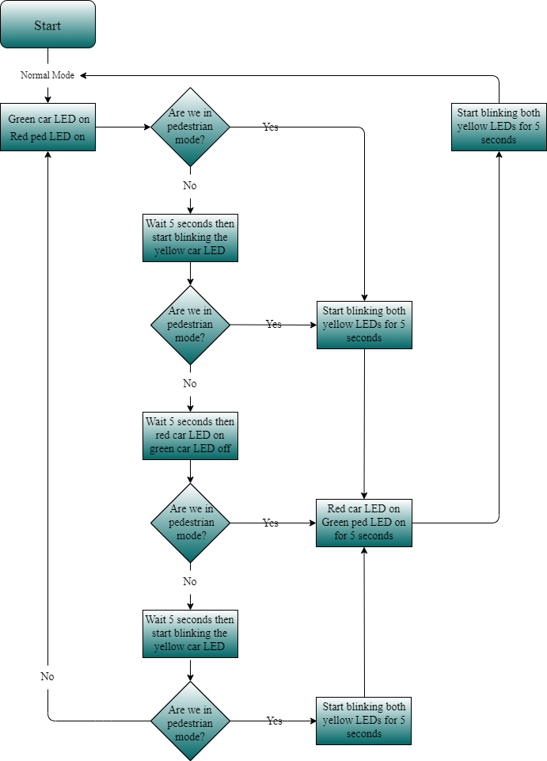
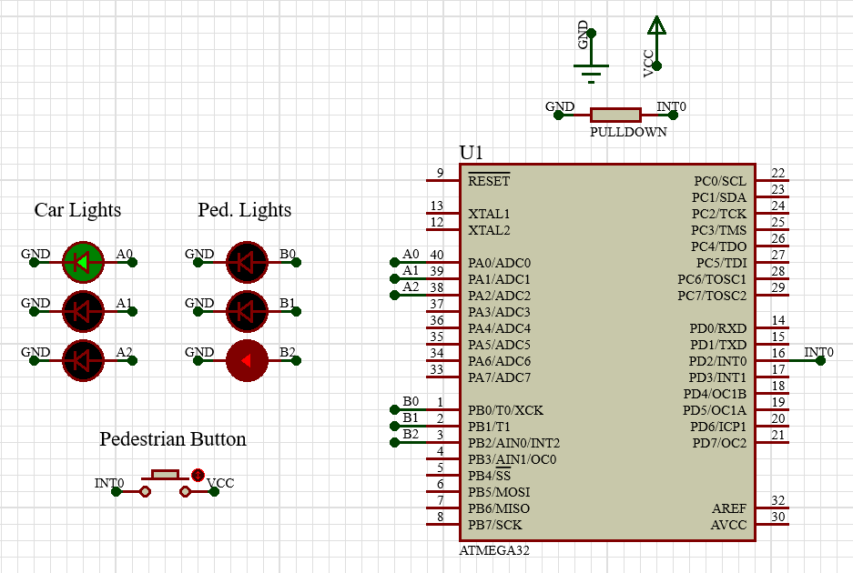

## Description
This is an embedded systems project which was assigned to me during my enrollment in Udacity's Embedded Systems Professional Nanodegree. It was done entirely on ATmega32.

It is basically a traffic light control system with 3 LEDs for traffic, 3 LEDs for pedestrians and an integrated push button for the pedestrians whenever they need to cross the street.
The system operates in two modes:
- Normal Mode which is always active unless interrupted by a pedestrian wanting to cross the street.
- Pedestrian Mode which determines how the pedestrian's LEDs behave according to the current traffic LEDs.

## Used Peripherals
- GPIO
- Interrupts
- Timers

## System's Flowchart

## Circuit

